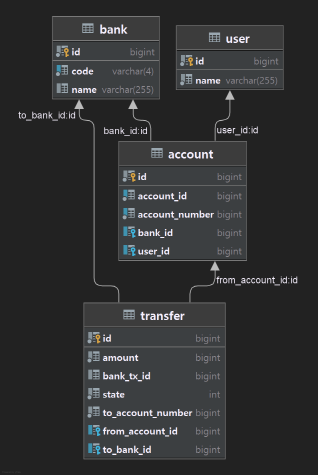

## 프로젝트 목표
**:  뱅킹 시스템 API를 연동해서 사용자간 계좌이체를 제공하는 API 서버를 구현**

## 시스템 구성도
Java, Spring Boot, MySQL

CI : Github Actions

코드관리 : Git, Github

배포 : doker, docker-compose 사용, DB의 경우, prod와 test DB를 분리하여 사용하고자 함.

사용자 데이터, 은행 데이터는 data.sql로 삽입 예정 (사용자 5개, 은행 3개 초기 세팅)

## 기능정리

1. **뱅킹 시스템 이용에 있어서 응답 대기 시간 설정**
   1. 응답 지연의 경우 연결 중단
      1. 연결을 끊은 경우 중단 기록을 남김
         1. 스케줄러를 통해 중단된 기록에 대해 이체결과 조회 API(GET /transfer/{tx_id})를 호출함
            1. 결과가 나온 상태라면 (응답코드 200)
               1. 데이터 베이스 결과 업데이트
            2. 결과가 나오지 않은 상태라면 (응답코드 400, 500)
               1. 사용자는 결과가 나올 동안 계좌이체 불가
   2. 사용자는 최근 거래 기록을 통해 확인 가능
2. **사용자의 계좌 등록**
   1. 입력값 validation
      1. 등록된 은행코드인가
      2. 계좌번호는 10자리 숫자인가
   2. 기존 등록된 계좌인지 확인
   3. 뱅킹 시스템을 활용하여 계좌등록 (POST /register)
      1. 200 응답 시, DB에 사용자 계좌등록
         2. 가능한 ID가 없다면 에러처리 
         3. 등록된 계좌 ID는 유니크 8자리의 숫자
         4. 클라이언트 정상 값 반환
      2. 타 status code 응답 시, 에러 핸들링 및 클라이언트에 반환
3. **등록된 계좌를 통해 타 계좌번호로 이체**
   1. 입력값 validation
      1. 등록 계좌 ID가 8자리 숫자인지
      2. 은행코드가 유효한가
      3. 계좌번호가 10자리 숫자인가
   2. 등록된 계좌 ID가 유효한지 확인
   3. 지연 거래 내역이 존재하는지 확인
   4. tx_id 생성
      1. 가능한 tx_id가 없다면 에러처리 
   5. 뱅킹 API 통해서 이체 API(POST /transfer) 요청
      1. 응답이 오래 걸림
         2. record에 중단 거래로 기록
         3. 클라이언트에 지연 응답 반환
      2. 실패든, 성공이든 모든 기록을 record에 남기고 후처리 및 클라이언트 반환
4. **계좌 거래 내역 조회**
   1. 입력값 validation
   2. 등록 계좌 ID가 8자리 숫자인지
   3. 등록된 계좌 ID가 유효한지 확인
   4. DB를 통해 거래 내역 조회

[comment]: <> (4. **최근 빈도 높은 이체 내역 조회** -> 추후 개발)

## 프로젝트 구조

## ERD

To-Do : 설명 달기

## 프로젝트 실행방법
1. docker-compose up [-D]
2. docker-compose down or ctrl + c

## API 명세

## 문제해결전략